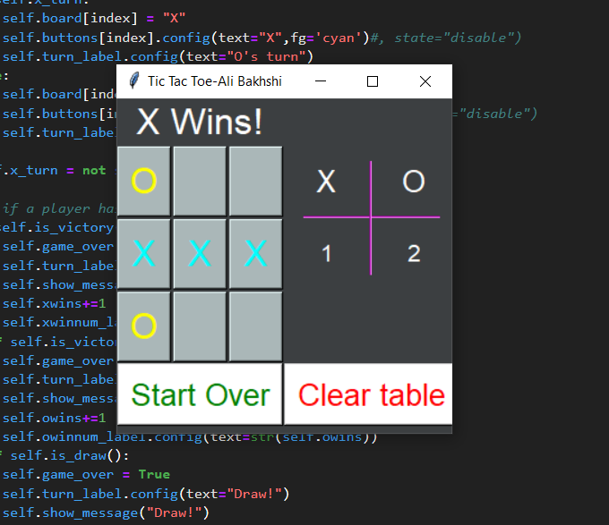
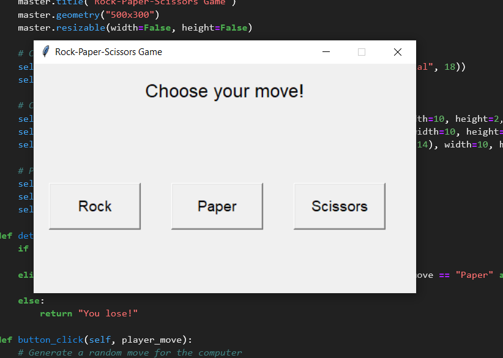

Python mini Games
==================
1) Tic-Tac-Toe (By [bakhshiali](https://github.com/bakhshiali)) 

Python tkinter GUI for Tic Tac Toe Game 
</img>

2) Dots-and-Boxes (under developement)
3) Classic-Snake (under developement)
4) Pong (under developement)
5) Car-Race (under developement)
6) Catch-the-Rain (under developement)
7) Chess (under developement)
8) Rock-Paper-Scissors (under developement)

Python tkinter GUI for Tic Tac Toe Game 
</img>

9) PacMan (under developement)
10) Tetris (under developement)
...

notes for me: 
1) add Flow diagram of games
2) add AI players

