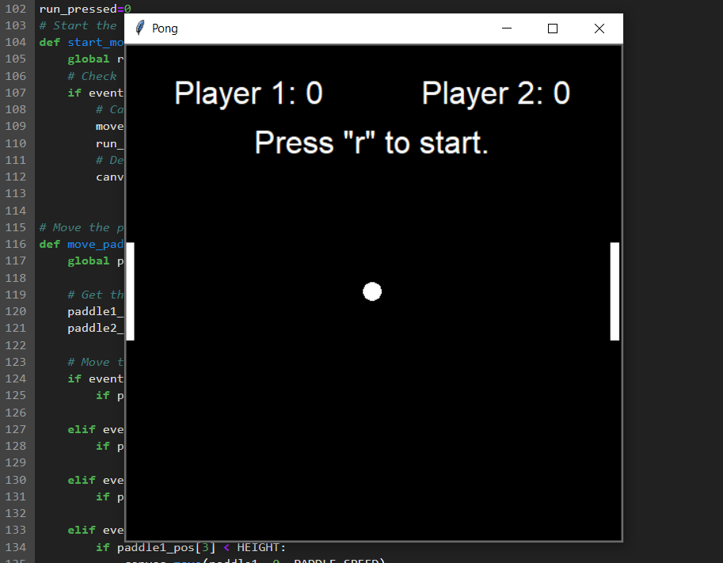

Python mini Games
==================
1) Tic-Tac-Toe (By [bakhshiali](https://github.com/bakhshiali)) 

Python tkinter GUI for Tic Tac Toe Game 
</img>

2) Dots-and-Boxes (under developement) 
3) Classic-Snake  

Python tkinter GUI for Snake Game 
</img>

4) Pong

Python tkinter GUI for Pong Game 
</img>

5) Car-Race (under developement) 
6) Catch-the-Rain (under developement) 
7) Chess (under developement) 
8) Rock-Paper-Scissors

Python tkinter GUI for Rock-Paper-Scissors Game 
</img>

9) PacMan (under developement) 
10) Tetris (under developement) 
...

notes for me: 
1) add Flow diagram of games
2) add AI players

