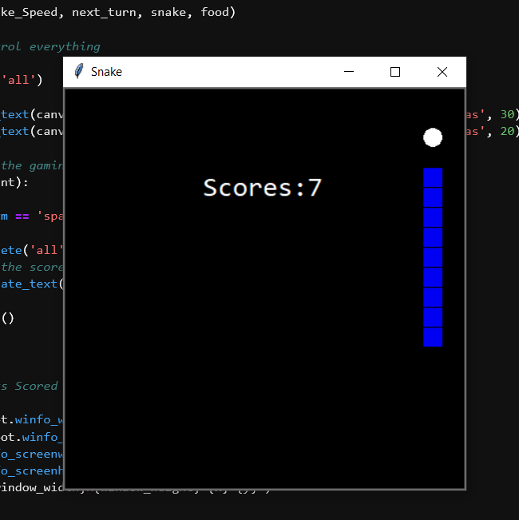

[](https://github.com/bakhshiali)
[](https://github.com/bakhshiali?tab=repositories)
# 🕹️ Snake
  Python tkinter GUI for Snake Game
## 📜 How to run?
### 🧪 Jupyter Lab
  1) install Jupyter lab
  
      Install JupyterLab with pip:
      ```
        pip install jupyterlab
        ```
  2) run Jupyter lab
  
      Once installed, launch JupyterLab windowsshell/terminal with:
      ```
        jupyter-lab
        ```
  3) Open "Snake.ipynb" file & run 1st cell
  
### 🐍 Python 

  1) download & install python from [here](https://www.python.org/downloads/)
  2) create new project "*.py" & copy 1st cell of "Snake.ipynb" file
  3) run project

## ⤵️ Project dependencies
  1) Tkinter : for GUI interface
  
      install with pip in terminal:
      ```
        pip install tk
        ```
      in linux install with sudo:
      ```
        sudo apt-get install python3-tk 
        ```
## ⚙️ features:
  1) show scores
  2) start over/reset

## 📸 Demo screenshot:

</img>

## 👨‍💻 Author: [Ali Bakhshi](https://github.com/bakhshiali)

## ❓🔔 📧 E-mail: alibakhshi255255@gmail.com
